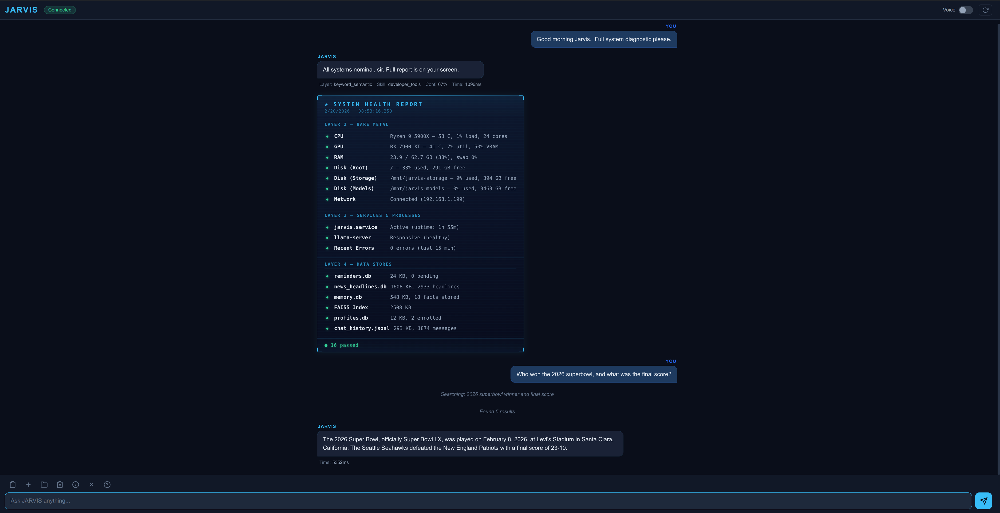
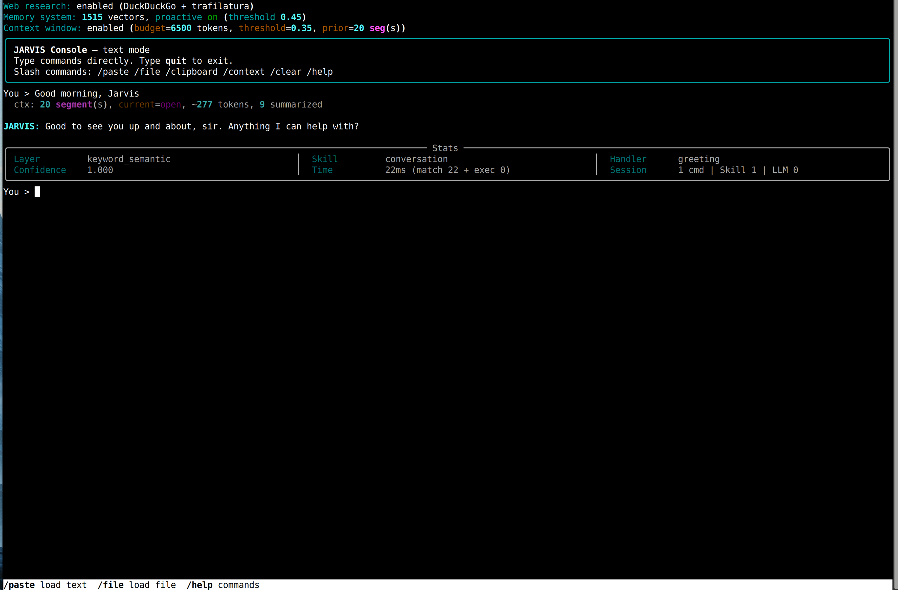

# JARVIS — GPU-Accelerated Voice Assistant

A fully local, privacy-first voice assistant built on AMD ROCm, fine-tuned speech recognition, and a local LLM — inspired by the AI from Iron Man. No cloud required for core operation.

**Built on:** Ubuntu 24.04 | Python 3.12 | ROCm 7.2 | AMD RX 7900 XT

---

## Highlights

- **0.1-0.2s speech recognition** — Fine-tuned Whisper on AMD GPU via CTranslate2 + ROCm (10-20x faster than CPU)
- **Local LLM intelligence** — Qwen 3-8B (Q5_K_M) via llama.cpp with web research tool calling
- **Natural blended voice** — Kokoro TTS with custom voice blend (fable + george), gapless streaming playback
- **Semantic understanding** — ML-based intent matching using sentence-transformers, not brittle regex patterns
- **Always-on listening** — Porcupine wake word + WebRTC VAD + multi-turn conversation windows
- **10 production skills** — time, weather, system info, filesystem, developer tools, desktop control, conversation, reminders, web research, news
- **Privacy by design** — everything runs locally; Claude API is a last-resort quality fallback only

---

## Screenshots

### Web UI

*Browser-based chat with streaming responses, health check HUD, web research, and file handling*

### Console Mode

*Terminal interface with rich stats panel showing match layer, skill routing, confidence, and timing*

---

## Table of Contents

- [Architecture](#architecture)
- [Skills & Capabilities](#skills--capabilities)
- [Hardware Requirements](#hardware-requirements)
- [Installation](#installation)
- [Model Setup](#model-setup)
- [The Kokoro Voice](#the-kokoro-voice)
- [Usage](#usage)
- [Project Structure](#project-structure)
- [Configuration Reference](#configuration-reference)
- [Python & ROCm Pitfalls](#python--rocm-pitfalls)
- [Fine-Tuning Whisper](#fine-tuning-whisper)
- [Development](#development)
- [License](#license)

---

## Architecture

```
                          ┌─────────────────────┐
                          │   Porcupine Wake     │
                          │   Word Detection     │
                          └──────────┬──────────┘
                                     │ "Jarvis"
                          ┌──────────▼──────────┐
                          │   WebRTC VAD +       │
                          │   Continuous Listener │
                          │   (speech detection) │
                          └──────────┬──────────┘
                                     │ audio frames
                          ┌──────────▼──────────┐
                          │   Whisper STT        │
                          │   (CTranslate2/GPU)  │
                          │   Fine-tuned model   │
                          └──────────┬──────────┘
                                     │ text
                  ┌──────────────────▼───────────────────┐
                  │         Skill Router                  │
                  │  Priority layers:                     │
                  │  1. Exact match (time, date)          │
                  │  2. Keyword match + semantic verify   │
                  │  3. Semantic intent matching          │
                  │  4. LLM fallback (Qwen 3-8B)         │
                  └──────┬──────────────┬────────────────┘
                         │              │
              ┌──────────▼───┐   ┌──────▼──────────┐
              │  Skill       │   │  LLM Router     │
              │  Handler     │   │  Qwen → Claude  │
              │  (direct)    │   │  + Web Research  │
              └──────────┬───┘   └──────┬──────────┘
                         │              │
                  ┌──────▼──────────────▼────────┐
                  │        Kokoro TTS             │
                  │   StreamingAudioPipeline      │
                  │   (gapless multi-sentence)    │
                  └──────────────┬────────────────┘
                                │ PCM audio
                          ┌─────▼──────┐
                          │   aplay    │
                          │  (ALSA)    │
                          └────────────┘
```

The system uses an **event-driven pipeline** with a Coordinator managing STT/TTS workers. The LLM response streams token-by-token, is chunked into sentences, and each sentence is synthesized and played as it arrives — so the user hears the first sentence while the LLM is still generating the rest.

### Key Subsystems

| Subsystem | What It Does |
|-----------|-------------|
| **Skill Router** | 4-layer routing: exact match → keyword + semantic verify → pure semantic → LLM fallback |
| **Conversation Windows** | After a response, keeps listening for follow-ups (timer-based auto-close, noise filtering) |
| **Web Research** | Qwen 3-8B calls DuckDuckGo + trafilatura to search and synthesize answers from live web sources |
| **Conversational Memory** | SQLite fact store + FAISS semantic search — remembers facts across sessions, surfaces them proactively |
| **Context Window** | Topic-segmented working memory with relevance-scored assembly across sessions |
| **Streaming TTS** | `StreamingAudioPipeline` — single persistent aplay process, background Kokoro generation, gapless playback |
| **Speaker ID** | Resemblyzer d-vector enrollment — identifies who's speaking and adjusts honorifics dynamically |

---

## Skills & Capabilities

### Core Skills

| Skill | Examples | How It Works |
|-------|---------|-------------|
| **Time & Date** | "What time is it?" / "What day is it?" | Direct system call, instant response |
| **Weather** | "What's the weather?" / "Will it rain?" | OpenWeatherMap API with natural language formatting |
| **System Info** | "What CPU do I have?" / "How much RAM?" | System queries with human-readable output |
| **Filesystem** | "Find my config file" / "Count lines in main.py" | File search, line counting, script analysis |
| **Developer Tools** | "Search the codebase for TODO" / "Git status" / "Show me the network" | 13 intents: codebase search, git multi-repo, system admin, general shell, visual output, 3-tier safety |
| **Desktop Control** | "Open Chrome" / "Volume up" / "Switch to workspace 2" | 16 intents: app launch/close, window management, volume, workspaces, focus, clipboard via GNOME Shell extension D-Bus bridge |
| **Conversation** | "Good morning" / "Thank you" / "How are you?" | Natural greetings, small talk, dismissal detection |
| **Reminders** | "Remind me at 3pm" / "What's on my schedule?" | Priority tones, nag behavior, acknowledgment tracking |
| **Web Research** | "How far is New York from London?" / "Who won the Super Bowl?" | Qwen 3-8B tool calling → DuckDuckGo → multi-source synthesis |
| **News** | "Read me the headlines" / "Any cybersecurity news?" | 16 RSS feeds, urgency classification, semantic dedup, category filtering |

### Additional Systems

- **GNOME Desktop Bridge** — Custom GNOME Shell extension providing Wayland-native window management, with wmctrl fallback for XWayland
- **Google Calendar** — Two-way sync with dedicated JARVIS calendar, OAuth, incremental sync, background polling
- **Daily & Weekly Rundowns** — Interactive state machine: offered → re-asked → deferred → retry → pending mention
- **Health Check** — 5-layer system diagnostic (GPU, LLM, STT, TTS, skills) with ANSI terminal report + voice summary
- **User Profiles** — Speaker identification via resemblyzer d-vectors, dynamic honorifics, voice enrollment

---

## Hardware Requirements

### Minimum

| Component | Requirement |
|-----------|------------|
| CPU | x86_64, 4+ cores |
| RAM | 8GB |
| Storage | 10GB free |
| Audio | USB microphone + speakers |
| OS | Ubuntu 24.04 LTS |

### Recommended (What This Was Built On)

| Component | Spec |
|-----------|------|
| CPU | AMD Ryzen 9 5900X (24 threads) |
| GPU | AMD RX 7900 XT (20GB VRAM) |
| RAM | 16GB+ |
| Microphone | USB condenser mic (FIFINE K669B tested) |
| OS | Ubuntu 24.04 LTS |
| ROCm | 7.2.0 |

> **GPU acceleration is optional but transformative.** CPU-only Whisper takes 0.3-0.5s per transcription. With GPU: 0.1-0.2s. The local LLM (Qwen 3-8B) also benefits from GPU offloading via llama.cpp.

---

## Installation

### 1. Clone the Repository

```bash
git clone https://github.com/YOUR_USER/jarvis.git ~/jarvis
cd ~/jarvis
```

### 2. Install System Dependencies

```bash
sudo apt update
sudo apt install -y \
    portaudio19-dev python3-pyaudio \
    build-essential cmake \
    alsa-utils \
    ffmpeg
```

### 3. Install Python Dependencies

JARVIS uses **system Python 3.12** — not a virtualenv. See [Python & ROCm Pitfalls](#python--rocm-pitfalls) for why.

```bash
pip install --break-system-packages -r requirements.txt

# Additional packages not in requirements.txt
pip install --break-system-packages \
    faster-whisper \
    sentence-transformers \
    resemblyzer \
    kokoro \
    soundfile \
    trafilatura \
    duckduckgo-search \
    faiss-cpu
```

### 4. Install llama.cpp (for local LLM)

```bash
cd ~
git clone https://github.com/ggml-org/llama.cpp
cd llama.cpp
mkdir build && cd build

# CPU-only build:
cmake .. -DCMAKE_BUILD_TYPE=Release
# OR with ROCm GPU:
cmake .. -DCMAKE_BUILD_TYPE=Release -DGGML_HIP=ON -DCMAKE_HIP_ARCHITECTURES=gfx1100

make -j$(nproc)
```

### 5. Install Piper TTS (fallback)

```bash
pip install --break-system-packages piper-tts
```

### 6. Configure API Keys

```bash
cp .env.example ~/jarvis/.env
nano ~/jarvis/.env
```

Fill in your keys:
- **PORCUPINE_ACCESS_KEY** — Free tier at [picovoice.ai](https://picovoice.ai/)
- **ANTHROPIC_API_KEY** — From [console.anthropic.com](https://console.anthropic.com/) (LLM fallback)
- **OPENWEATHER_API_KEY** — Free tier at [openweathermap.org](https://openweathermap.org/api) (weather skill)

### 7. Download Models

See [Model Setup](#model-setup) below for detailed instructions with download links.

### 8. Configure

Edit `config.yaml` and update paths to match your model locations. See [Configuration Reference](#configuration-reference).

### 9. Set Up Systemd Service

```bash
mkdir -p ~/.config/systemd/user
cp jarvis.service ~/.config/systemd/user/

# If using a local LLM:
cp llama-server.service ~/.config/systemd/user/

# Enable linger (service runs without active login)
loginctl enable-linger $USER

# Enable and start
systemctl --user daemon-reload
systemctl --user enable jarvis
systemctl --user start jarvis

# Check status
systemctl --user status jarvis
journalctl --user -u jarvis -f
```

### 10. Test

Say: **"Jarvis, what time is it?"**

Or use console mode (no microphone needed):
```bash
python3 jarvis_console.py
```

---

## Model Setup

JARVIS uses several AI models. Here's where to get each one.

### Whisper STT (Speech-to-Text)

| Model | Source | Format | Purpose |
|-------|--------|--------|---------|
| **whisper-base** | [ggerganov/whisper.cpp](https://huggingface.co/ggerganov/whisper.cpp/resolve/main/ggml-base.bin) | GGML | CPU fallback |
| **faster-whisper base** | Auto-downloaded by `faster-whisper` | CTranslate2 | GPU-accelerated (recommended) |

```bash
# CPU fallback model (optional)
mkdir -p /path/to/models/whisper
wget -O /path/to/models/whisper/ggml-base.bin \
    https://huggingface.co/ggerganov/whisper.cpp/resolve/main/ggml-base.bin
```

The GPU model is auto-downloaded by `faster-whisper` on first run. You can also [fine-tune Whisper](#fine-tuning-whisper) on your accent.

### Qwen 3-8B LLM

| Model | Source | Format | Quantization |
|-------|--------|--------|-------------|
| **Qwen3-8B-Instruct** | [Qwen/Qwen3-8B-GGUF](https://huggingface.co/Qwen/Qwen3-8B-GGUF) | GGUF | Q5_K_M recommended |

```bash
mkdir -p /path/to/models/llm
# Download Q5_K_M quantization (~5.5GB)
wget -O /path/to/models/llm/Qwen3-8B-Q5_K_M.gguf \
    "https://huggingface.co/Qwen/Qwen3-8B-GGUF/resolve/main/qwen3-8b-q5_k_m.gguf"
```

The LLM runs via llama.cpp as a server process. The systemd service `llama-server.service` manages it.

### Kokoro TTS (Primary Voice)

| Model | Source | Size | Runtime |
|-------|--------|------|---------|
| **Kokoro-82M** | [hexgrad/Kokoro-82M](https://huggingface.co/hexgrad/Kokoro-82M) | 82M params | CPU (in-process) |

Kokoro auto-downloads from HuggingFace Hub on first initialization. No manual download needed.

See [The Kokoro Voice](#the-kokoro-voice) for how the custom voice blend works.

### Piper TTS (Fallback)

| Model | Source | Format |
|-------|--------|--------|
| **en_GB-northern_english_male-medium** | [rhasspy/piper-voices](https://huggingface.co/rhasspy/piper-voices/tree/main/en/en_GB/northern_english_male/medium) | ONNX |

```bash
mkdir -p /path/to/models/piper
cd /path/to/models/piper

wget https://huggingface.co/rhasspy/piper-voices/resolve/main/en/en_GB/northern_english_male/medium/en_GB-northern_english_male-medium.onnx
wget https://huggingface.co/rhasspy/piper-voices/resolve/main/en/en_GB/northern_english_male/medium/en_GB-northern_english_male-medium.onnx.json
```

### Sentence Transformers (Semantic Matching)

| Model | Source | Purpose |
|-------|--------|---------|
| **all-MiniLM-L6-v2** | [sentence-transformers](https://huggingface.co/sentence-transformers/all-MiniLM-L6-v2) | Intent matching, memory search |

Auto-downloads on first use. Set `cache_dir` in config.yaml to control where it's stored.

### Porcupine (Wake Word)

| Component | Source | Note |
|-----------|--------|------|
| **pvporcupine** | [picovoice.ai](https://picovoice.ai/) | Requires free API key |

Get a free access key from Picovoice and add it to your `.env` file.

### Resemblyzer (Speaker ID)

| Model | Source | Purpose |
|-------|--------|---------|
| **VoiceEncoder** | [resemblyzer](https://github.com/resemble-ai/Resemblyzer) | Speaker identification via d-vectors |

Auto-downloads on first use (~5MB model). Used for identifying who's speaking and adjusting behavior per user.

---

## The Kokoro Voice

JARVIS uses [Kokoro-82M](https://huggingface.co/hexgrad/Kokoro-82M), a lightweight 82-million parameter TTS model that runs on CPU. What makes it special is the **voice blending** system.

### How Voice Blending Works

Kokoro ships with multiple voice presets as PyTorch tensors (`.pt` files). JARVIS loads two voices and blends them via linear interpolation:

```python
# From core/tts.py — the voice blend
voice_a = torch.load("bm_fable.pt")    # British male, warm
voice_b = torch.load("bm_george.pt")   # British male, deeper
blended = voice_a * 0.5 + voice_b * 0.5  # 50/50 blend
```

This creates a voice that has the warmth of "fable" with the depth of "george" — more natural than either voice alone.

### Configuration

```yaml
# config.yaml
tts:
  engine: kokoro
  kokoro_voice_a: bm_fable        # First voice
  kokoro_voice_b: bm_george       # Second voice
  kokoro_blend_ratio: 0.5         # 0.0 = all george, 1.0 = all fable
  kokoro_speed: 1.0               # Playback speed
```

### Available Voices

Kokoro includes several voice presets. The `bm_` prefix means "British male":
- `bm_fable` — warm, narrator-like
- `bm_george` — deeper, more authoritative
- `bf_emma` — British female
- `am_adam` — American male
- And more — check the [Kokoro model card](https://huggingface.co/hexgrad/Kokoro-82M) for the full list.

### Why Kokoro Over Other TTS?

We evaluated several TTS engines:

| Engine | Verdict | Notes |
|--------|---------|-------|
| **Kokoro 82M** | Primary | Best quality-to-speed ratio. CPU-only avoids GPU contention with STT. 82M params loads in <2s. |
| **Piper** | Fallback | Good but more robotic. ONNX format, subprocess-based. Used when Kokoro fails to initialize. |
| **StyleTTS 2** | Rejected | Superior quality but 10x slower, required GPU (competing with STT), and PyTorch dependency conflicts. |

### Streaming Playback

JARVIS doesn't wait for the full response before speaking. The `StreamingAudioPipeline` synthesizes each sentence in the background while the previous one plays, maintaining a single persistent `aplay` process for gapless audio.

---

## Usage

### Voice Mode (Production)

```bash
# Start via systemd
systemctl --user start jarvis

# Check status
systemctl --user status jarvis

# Live logs
journalctl --user -u jarvis -f
```

Say the wake word ("Jarvis") followed by your command:
- *"Jarvis, what time is it?"*
- *"Jarvis, what's the weather like?"*
- *"Jarvis, remind me to check the oven in 20 minutes"*
- *"Jarvis, search the codebase for TODO"*
- *"Jarvis, who won the Super Bowl?"*
- *"Jarvis, read me the tech headlines"*
- *"Jarvis, open Chrome"*
- *"Jarvis, volume up"*

After JARVIS responds, you have a **conversation window** (default 4 seconds) to ask follow-up questions without repeating the wake word.

### Console Mode

```bash
# Text-only mode — type commands, see responses + stats panel
python3 jarvis_console.py

# Hybrid mode — type commands, responses printed AND spoken
python3 jarvis_console.py --hybrid

# Speech mode — full voice pipeline via terminal
python3 jarvis_console.py --speech
```

The console displays a stats panel after each command showing match layer, skill, confidence score, timing, and LLM token counts.

### Web UI

```bash
# Start the web interface
python3 jarvis_web.py

# Then open http://127.0.0.1:8088 in your browser
```

The web UI provides the same full skill pipeline with streaming LLM responses, drag/drop file handling, web research, conversation history with scroll-back, and an optional voice toggle for spoken output.

---

## Project Structure

```
jarvis/
├── jarvis_continuous.py          # Production entry point (voice mode)
├── jarvis_console.py             # Console/debug entry point
├── jarvis_web.py                 # Web UI entry point (browser-based chat)
├── config.yaml                   # Main configuration
├── .env                          # API keys (not in repo — see .env.example)
├── requirements.txt              # Python dependencies
│
├── core/                         # Core modules
│   ├── stt.py                    # Speech-to-text (faster-whisper + CTranslate2)
│   ├── tts.py                    # Text-to-speech (Kokoro + Piper)
│   ├── llm_router.py             # LLM routing (Qwen → quality gate → Claude fallback)
│   ├── web_research.py           # Web search tool calling (DuckDuckGo + trafilatura)
│   ├── skill_manager.py          # Skill loading + 4-layer routing
│   ├── semantic_matcher.py       # Sentence transformer intent matching
│   ├── continuous_listener.py    # VAD + wake word + conversation windows
│   ├── tts_normalizer.py         # Text normalization for natural speech
│   ├── conversation.py           # History, cross-session memory, follow-up logic
│   ├── memory_manager.py         # Conversational memory (SQLite + FAISS)
│   ├── context_window.py         # Topic-segmented working memory
│   ├── reminder_manager.py       # Reminders, rundowns, calendar sync
│   ├── google_calendar.py        # Google Calendar OAuth + sync
│   ├── news_manager.py           # RSS monitoring + classification
│   ├── desktop_manager.py        # GNOME D-Bus bridge + wmctrl fallback + volume/clipboard
│   ├── health_check.py           # System diagnostics
│   ├── user_profile.py           # User profiles + speaker ID
│   ├── speaker_id.py             # Resemblyzer d-vector enrollment
│   ├── honorific.py              # Dynamic honorific resolution
│   ├── config.py                 # Configuration loader
│   ├── logger.py                 # Logging setup
│   └── base_skill.py             # Skill base class
│
├── skills/                       # Skill implementations
│   ├── system/
│   │   ├── time_info/            # Time and date
│   │   ├── weather/              # Weather forecasts
│   │   ├── system_info/          # CPU, RAM, disk info
│   │   ├── filesystem/           # File search, line counting
│   │   ├── developer_tools/      # Codebase search, git, shell
│   │   ├── app_launcher/         # Desktop control (16 intents: apps, windows, volume, workspaces, clipboard)
│   │   └── web_navigation/       # Web search + browsing
│   └── personal/
│       ├── conversation/         # Greetings, small talk
│       ├── reminders/            # Voice reminders + calendar
│       └── news/                 # RSS headline delivery
│
├── web/                          # Web UI frontend
│   ├── index.html                # Chat layout
│   ├── style.css                 # Dark theme
│   └── app.js                    # WebSocket client + rendering
├── images/                       # Screenshots
├── extensions/                   # GNOME Shell extensions
│   └── jarvis-desktop@jarvis/    # Desktop Bridge (D-Bus service for window/workspace control)
├── assets/                       # Audio cues (generate your own .wav files)
├── scripts/                      # Utility scripts
│   ├── install_desktop_extension.sh  # Install GNOME Shell extension
│   ├── test_desktop_manager.py       # Test desktop manager module
│   ├── enroll_speaker.py             # Speaker voice enrollment
│   ├── init_profiles.py              # User profile initialization
│   └── ...
├── docs/                         # Documentation
│   ├── SETUP_GUIDE.md            # Detailed installation
│   ├── SKILL_DEVELOPMENT.md      # How to create skills
│   ├── SEMANTIC_INTENT_MATCHING.md
│   ├── VOICE_TRAINING_GUIDE.md   # Whisper fine-tuning
│   └── ...
└── tools/                        # Backup and maintenance scripts
```

---

## Configuration Reference

The main configuration lives in `config.yaml`. Here are the key sections:

### Audio

```yaml
audio:
  mic_device: "USB PnP Audio Device"   # Your microphone name
  sample_rate: 16000                    # Don't change (Whisper expects 16kHz)
  channels: 1
  output_device: plughw:0,0            # ALSA output device
  device_monitor_interval: 5.0         # Hot-plug detection interval
```

### LLM

```yaml
llm:
  local:
    model_path: /path/to/models/llm/Qwen3-8B-Q5_K_M.gguf
    context_size: 8192
    gpu_layers: 999          # Offload all layers to GPU (if available)
    temperature: 0.6
    tool_calling: true       # Enable web research
  api:
    provider: anthropic      # Fallback LLM
    model: claude-sonnet-4-20250514
    api_key_env: ANTHROPIC_API_KEY
```

### TTS

```yaml
tts:
  engine: kokoro                      # 'kokoro' or 'piper'
  kokoro_voice_a: bm_fable
  kokoro_voice_b: bm_george
  kokoro_blend_ratio: 0.5             # Voice blend
  kokoro_speed: 1.0
  # Piper fallback
  model_path: /path/to/models/piper/en_GB-northern_english_male-medium.onnx
  config_path: /path/to/models/piper/en_GB-northern_english_male-medium.onnx.json
```

### Semantic Matching

```yaml
semantic_matching:
  enabled: true
  model: all-MiniLM-L6-v2
  cache_dir: /path/to/models/sentence-transformers
  default_threshold: 0.85    # Minimum confidence for intent match
  fallback_to_llm: true      # Send unmatched queries to LLM
```

For the full configuration reference, see the comments in `config.yaml`.

---

## Python & ROCm Pitfalls

Building JARVIS on an AMD GPU with ROCm taught some hard lessons. Here's what to watch out for.

### Use System Python, Not Virtualenvs

JARVIS runs on **system Python 3.12** with `--break-system-packages`. This sounds wrong, but:

- **ROCm libraries** (`/opt/rocm-7.2.0/lib/`) must be on the system `LD_LIBRARY_PATH`
- **CTranslate2** is built from source against ROCm — it links to system-level `.so` files
- **PyTorch ROCm** (`torch+rocm7.1`) also needs the same ROCm libraries
- Virtualenvs create isolation that **breaks these shared library dependencies**

We tested a CUDA-targeted venv. It was 9.3GB and completely non-functional on AMD hardware. Lesson learned.

### CTranslate2 Must Be Built from Source for ROCm

The pip version of CTranslate2 is CUDA-only. For AMD GPUs:

```bash
git clone --recursive https://github.com/OpenNMT/CTranslate2.git
cd CTranslate2 && mkdir build && cd build

cmake .. \
  -DWITH_HIP=ON \
  -DWITH_MKL=OFF \
  -DWITH_OPENBLAS=ON \
  -DCMAKE_HIP_ARCHITECTURES=gfx1100 \
  -DCMAKE_BUILD_TYPE=Release \
  -DCMAKE_HIP_COMPILER=/opt/rocm/lib/llvm/bin/clang++ \
  -DCMAKE_CXX_COMPILER=/opt/rocm/lib/llvm/bin/clang++ \
  -DCMAKE_C_COMPILER=/opt/rocm/lib/llvm/bin/clang \
  -DCMAKE_PREFIX_PATH=/opt/rocm \
  -DBUILD_CLI=OFF

make -j$(nproc)
sudo make install && sudo ldconfig

# Python bindings
cd ../python
pip install --break-system-packages .
```

Find your GPU architecture with `rocminfo | grep gfx`.

### PyTorch + CTranslate2 Coexistence

Both PyTorch (`torch 2.10.0+rocm7.1`) and CTranslate2 use `/opt/rocm-7.2.0/lib/`. They coexist fine **if**:

1. Both are installed at the system level (not in separate venvs)
2. `LD_LIBRARY_PATH` includes `/opt/rocm-7.2.0/lib/`
3. The ROCm environment variables are set:

```bash
export HSA_OVERRIDE_GFX_VERSION=11.0.0
export ROCM_PATH=/opt/rocm-7.2.0
export LD_LIBRARY_PATH=/opt/rocm-7.2.0/lib
```

### Environment Variables for ROCm

These must be set for both the systemd service and any manual runs:

| Variable | Value | Purpose |
|----------|-------|---------|
| `HSA_OVERRIDE_GFX_VERSION` | `11.0.0` | GPU architecture override for RDNA 3 |
| `ROCM_PATH` | `/opt/rocm-7.2.0` | ROCm installation path |
| `LD_LIBRARY_PATH` | `/opt/rocm-7.2.0/lib` | Shared library search path |

### Import Order Matters (Historical)

Early in development, the order of `import torch` vs `import ctranslate2` determined which ROCm version was loaded. This is resolved now, but as a defensive practice, `core/stt.py` avoids importing torch directly.

---

## Fine-Tuning Whisper

JARVIS supports fine-tuning Whisper on your voice and accent. This is what transforms it from a generic model into one that understands *you*.

### Why Fine-Tune?

The base Whisper model struggles with:
- Regional accents (Southern US, British dialects, etc.)
- Domain-specific vocabulary (technical terms, project names)
- Proper nouns it hasn't seen

### Process

1. **Record training data** — 150+ utterances covering problem words, domain vocabulary, and natural speech patterns
2. **Train** — Fine-tune from the base Whisper model using HuggingFace Transformers
3. **Convert** — Export to CTranslate2 format for GPU-accelerated inference
4. **Deploy** — Update `config.yaml` to point to the new model

See [docs/VOICE_TRAINING_GUIDE.md](docs/VOICE_TRAINING_GUIDE.md) for the complete process.

### Results

| Metric | Before | After |
|--------|--------|-------|
| General accuracy | ~80% | ~88%+ |
| Domain vocabulary | ~60% | ~90%+ |
| Latency (GPU) | 0.1-0.2s | 0.1-0.2s (unchanged) |

---

## Development

### Adding a New Skill

JARVIS skills are self-contained Python modules. See [docs/SKILL_DEVELOPMENT.md](docs/SKILL_DEVELOPMENT.md) for the full guide.

Quick overview:

```
skills/system/your_skill/
├── skill.py           # Main logic (extends BaseSkill)
├── metadata.yaml      # Skill config + semantic intents
└── __init__.py        # Exports
```

Skills register **semantic intents** (natural language examples) instead of regex patterns:

```yaml
# metadata.yaml
intents:
  - "turn on the lights"
  - "switch the lights off"
  - "dim the bedroom lights"
```

The sentence-transformer model matches user speech against these examples — no fragile pattern maintenance.

### Architecture Principles

1. **Privacy first** — Everything runs locally. Claude API is a quality fallback, not a dependency.
2. **Semantic over regex** — ML-based intent matching means 3-9 examples replace 100+ patterns.
3. **Streaming everything** — LLM tokens stream to TTS, TTS streams to audio. No waiting for full responses.
4. **Graceful degradation** — GPU fails? Fall back to CPU. Kokoro fails? Fall back to Piper. Local LLM fails? Fall back to Claude API.
5. **Defensive conventions** — If something caused 18 hours of debugging once, we keep the guard rails even after fixing the root cause.

---

## Acknowledgments

### Models & Libraries

- [Kokoro-82M](https://huggingface.co/hexgrad/Kokoro-82M) by hexgrad — TTS model
- [faster-whisper](https://github.com/SYSTRAN/faster-whisper) by SYSTRAN — GPU-accelerated Whisper
- [CTranslate2](https://github.com/OpenNMT/CTranslate2) by OpenNMT — Inference engine
- [llama.cpp](https://github.com/ggml-org/llama.cpp) by ggml-org — LLM inference
- [Qwen3-8B](https://huggingface.co/Qwen/Qwen3-8B) by Qwen — Local LLM
- [Piper](https://github.com/rhasspy/piper) by rhasspy — Fallback TTS
- [sentence-transformers](https://github.com/UKPLab/sentence-transformers) — Semantic matching
- [Porcupine](https://picovoice.ai/) by Picovoice — Wake word detection
- [Resemblyzer](https://github.com/resemble-ai/Resemblyzer) by Resemble AI — Speaker identification
- [Playwright](https://playwright.dev/) — Web navigation

---

## License

MIT License — see [LICENSE](LICENSE) for details.

---

**Version:** 2.3.0
**Status:** Production — actively developed
**Last Updated:** February 2026
